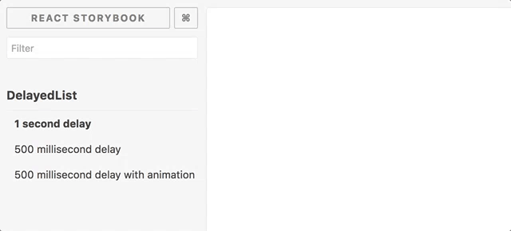

# react-delayed-list 🕐🕑🕒

## What?

A delayed list rendering React component.

Pass in a delay prop and each child prop of the DelayedList will be rendered that many milliseconds apart from each other.

ReactCSSTransitionGroup inbuilt to allow animations per child on render.



## Installation

`npm install --save react-delayed-list`

## Testing

`npm test` - 100% test coverage.

## API

Two props are taken:
- `delay` - time between child rendering in ms
- `transitionClass` - CSS class name to use with ReactCSSTransitionGroup. Defaults to `delayed-list-items`


## Examples

### 1 second delay
```
<DelayedList delay={1000}>
  <h1>DelayedList</h1>
  <h2>Is</h2>
  <h3>Awesome</h3>
</DelayedList>
```

### 500 millisecond delay with animation
```
import './style.css';

...

<DelayedList delay={500} transitionClass='mylist'>
  <h1>DelayedList</h1>
  <h2>Is</h2>
  <h3>Awesome</h3>
</DelayedList>


// style.css

.mylist-enter {
    opacity: 0;
    transform:   translate(-250px,0);
    transform: translate3d(-250px,0,0);
}

.mylist-enter.mylist-enter-active {
  	opacity: 1;
  	transition: opacity 1s ease;
  	transform: translate(0,0);
  	transform: translate3d(0,0,0);
  	transition-property: transform, opacity;
  	transition-duration: 500ms;
  	transition-timing-function: cubic-bezier(0.175, 0.665, 0.320, 1), linear;
}

```

## Todo:

- Benchmarks
